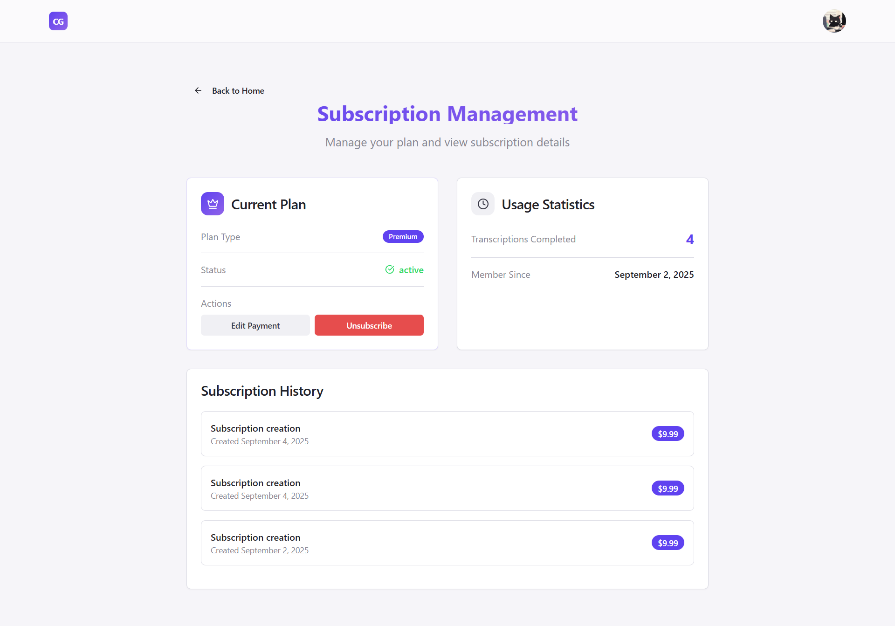

# Caption Generator - Backend

> You can also read in **[English](./README.md)** 🇺🇸

Backend API para transcrição de áudio e vídeo com autenticação Google e pagamentos via Stripe.

## 📋 Sobre o Projeto

O Caption Generator é uma aplicação que permite aos usuários fazer upload de arquivos de áudio ou vídeo e receber transcrições em tempo real. O backend gerencia autenticação, processamento de arquivos, transcrições via Whisper e pagamentos.

## 🎯 Objetivo do Projeto

Este projeto tem como foco principal a aplicação prática de três conceitos técnicos essenciais:

- **Node.js Streams** e Server-Sent Events para processamento de arquivos em tempo real
- **Integração completa com Stripe** para sistema de pagamentos e assinaturas
- **Terraform** para automatizar o deploy e gerenciar infraestrutura na AWS
- **CI/CD** para deploy contínuo

O desenvolvimento prioriza o aprendizado e experimentação dessas tecnologias, implementando uma arquitetura que demonstra como integrar streaming de dados, pagamentos seguros e Infrastructure as Code (IaC). Algumas funcionalidades foram desenvolvidas com abordagem MVP para acelerar o processo de aprendizado e prototipação dos conceitos core.

## 📸 Screenshots do frontend

### Página inicial


### Página de Subscrição



### ✨ Principais Funcionalidades

- 🔐 **Autenticação Google** via Passport.js
- 🎵 **Transcrição de áudio/vídeo** usando Whisper
- 💳 **Sistema de pagamentos** com Stripe (planos Free e Premium)
- 🔄 **Processamento em tempo real** com Server-Sent Events (SSE)
- 📁 **Upload de arquivos** com validação de tipo e tamanho
- 🗄️ **Banco de dados** gerenciado via Prisma ORM

## 🛠️ Tecnologias

- **Node.js** + TypeScript
- **Express.js** - Framework web
- **Passport.js** - Autenticação Google
- **Stripe** - Processamento de pagamentos
- **Prisma ORM** - Gerenciamento do banco de dados
- **Supabase** - Banco de dados PostgreSQL
- **Whisper** - Transcrição de áudio para texto
- **Multer** - Manipulação de arquivos
- **Docker** - Containerização
- **Terraform** - Infraestrutura como código
- **GitHub Actions** - Integração contínua

## 🚀 Como Executar

### Pré-requisitos

- Node.js (v18 ou superior)
- Docker e Docker Compose
- Conta no Google Cloud Console (para OAuth)
- Conta no Stripe
- Conta no Supabase

### Instalação

1. **Clone o repositório**

```bash
git clone https://github.com/Darlan0307/Capition-Generate-API.git
```

2. **Configure as variáveis de ambiente**

```bash
cp .env.example .env
```

Preencha o arquivo `.env` com suas configurações:

```env
PORT=4000

WHISPER_MODEL_PATH= # Caminho para o modelo Whisper (base.en, tiny.en, outro)
WHISPER_BIN= # Caminho para o binário Whisper (whisper.cli, whisper.cpp, outro)

DATABASE_URL=
DIRECT_URL=
FRONTEND_URL=

AUTH_SECRET=
JWT_SECRET=

GOOGLE_CLIENT_ID=
GOOGLE_CLIENT_SECRET=
GOOGLE_CALLBACK_URL=

NODE_ENV=

STRIPE_WEBHOOK_SECRET=
STRIPE_SECRET_KEY=
STRIPE_SUBSCRIPTION_PRICE_ID=
```

3. **Execute com Docker**

```bash
docker compose up -d
```

**OU execute localmente:**

```bash
# Instalar dependências
npm install

# Iniciar o servidor
npm run dev
```

O servidor estará rodando em `http://localhost:4000`

## 📚 Documentação da API

### Autenticação

#### `GET /auth/google`

Inicia o processo de autenticação com Google OAuth

#### `GET /auth/google/callback`

Callback para processar retorno da autenticação Google

### Transcrição

#### `POST /transcribe`

Faz upload e transcreve arquivo de áudio/vídeo

**Headers:**

```
cookie: auth-token=<jwt-token>
```

**Body:**

- `media`: Arquivo de áudio ou vídeo

**Response:** Stream de eventos (SSE) com progresso da transcrição

### Pagamentos

#### `POST /checkout-session`

Cria sessão de checkout do Stripe para assinatura

#### `POST /webhook`

Processa eventos do webhook do Stripe

## 🐳 Docker

O projeto inclui configuração Docker com:

- Instalação do Whisper
- Configuração do ambiente Node.js
- Dependências do sistema para processamento de áudio

## 🗄️ Banco de Dados

O projeto usa Prisma ORM com Supabase (PostgreSQL).

Para executar migrações:

```bash
npx prisma migrate dev
```

Para visualizar o banco:

```bash
npx prisma studio
```

## 🔧 Scripts Disponíveis

```bash
npm run dev          # Desenvolvimento
npm run build        # Build para produção
npm run start        # Inicia servidor de produção
```

## 🌐 Demonstração

https://site-caption-generator.vercel.app/

## 📄 Licença

Esse projeto está sob a licença (MIT) - acesse os detalhes [aqui](https://choosealicense.com/licenses/mit/).
