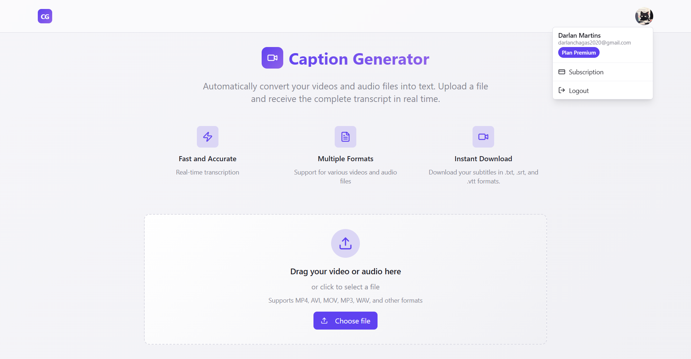

# Caption Generator - Backend

> Você também pode ler em **[Português](./README-PT.md)** 🇧🇷

Backend API for audio and video transcription with Google authentication and Stripe payments.

## 📋 About the Project

Caption Generator is an application that allows users to upload audio or video files and receive real-time transcriptions. The backend handles authentication, file processing, Whisper transcriptions, and payments.

## 🎯 Project Objective

This project's main focus is the practical application of three essential technical concepts:

- **Node.js Streams** and Server-Sent Events for real-time file processing
- **Complete Stripe integration** for payment system and subscriptions
- **Terraform** to automate deployment and manage infrastructure on AWS
- **CI/CD** for continuous deployment

The development prioritizes learning and experimentation with these technologies, implementing an architecture that demonstrates how to integrate data streaming, secure payments, and Infrastructure as Code (IaC). Some features were developed with an MVP approach to accelerate the learning and prototyping process of the core concepts.

## 📸 Frontend Screenshots

### Homepage



### Subscription Page


### ✨ Key Features

- 🔐 **Google Authentication** via Passport.js
- 🎵 **Audio/video transcription** using Whisper
- 💳 **Payment system** with Stripe (Free and Premium plans)
- 🔄 **Real-time processing** with Server-Sent Events (SSE)
- 📁 **File upload** with type and size validation
- 🗄️ **Database** managed via Prisma ORM

## 🛠️ Technologies

- **Node.js** + TypeScript
- **Express.js** - Web framework
- **Passport.js** - Google authentication
- **Stripe** - Payment processing
- **Prisma ORM** - Database management
- **Supabase** - PostgreSQL database
- **Whisper** - Audio to text transcription
- **Multer** - File handling
- **Docker** - Containerization
- **Terraform** - Infrastructure as code
- **GitHub Actions** - Continuous integration

## 🚀 How to Run

### Prerequisites

- Node.js (v18 or higher)
- Docker and Docker Compose
- Google Cloud Console account (for OAuth)
- Stripe account
- Supabase account

### Installation

1. **Clone the repository**

```bash
git clone https://github.com/Darlan0307/Capition-Generate-API.git
```

2. **Configure environment variables**

```bash
cp .env.example .env
```

Fill the `.env` file with your configurations:

```env
PORT=4000

WHISPER_MODEL_PATH= # Path to Whisper model (base.en, tiny.en, other)
WHISPER_BIN= # Path to Whisper binary (whisper.cli, whisper.cpp, other)

DATABASE_URL=
DIRECT_URL=
FRONTEND_URL=

AUTH_SECRET=
JWT_SECRET=

GOOGLE_CLIENT_ID=
GOOGLE_CLIENT_SECRET=
GOOGLE_CALLBACK_URL=

NODE_ENV=

STRIPE_WEBHOOK_SECRET=
STRIPE_SECRET_KEY=
STRIPE_SUBSCRIPTION_PRICE_ID=
```

3. **Run with Docker**

```bash
docker compose up -d
```

**OR run locally:**

```bash
# Install dependencies
npm install

# Start the server
npm run dev
```

The server will be running at `http://localhost:4000`

## 📚 API Documentation

### Authentication

#### `GET /auth/google`

Initiates Google OAuth authentication process

#### `GET /auth/google/callback`

Callback to process Google authentication return

### Transcription

#### `POST /transcribe`

Uploads and transcribes audio/video file

**Headers:**

```
cookie: auth-token=<jwt-token>
```

**Body:**

- `media`: Audio or video file

**Response:** Event stream (SSE) with transcription progress

### Payments

#### `POST /checkout-session`

Creates Stripe checkout session for subscription

#### `POST /webhook`

Processes Stripe webhook events

## 🐳 Docker

The project includes Docker configuration with:

- Whisper installation
- Node.js environment setup
- System dependencies for audio processing

## 🗄️ Database

The project uses Prisma ORM with Supabase (PostgreSQL).

To run migrations:

```bash
npx prisma migrate dev
```

To view the database:

```bash
npx prisma studio
```

## 🔧 Available Scripts

```bash
npm run dev          # Development
npm run build        # Production build
npm run start        # Start production server
```

## 🌐 Demo

https://site-caption-generator.vercel.app/

## 📄 License

This project is under the (MIT) license - see details [here](https://choosealicense.com/licenses/mit/).
